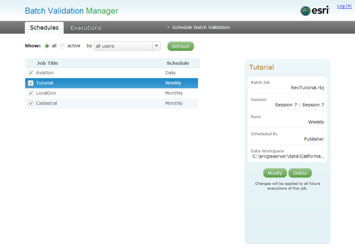

# datareviewer-bvm-js

## Features

Batch Validation Manager (BVM) is a JavaScript web application to manage the validation of data using services provided by ArcGIS Data Reviewer for Server. The application can be configured to run Data Reviewer Batch Jobs either on a recurring basis—daily, weekly, monthly, or yearly—or once at a future date. A scheduled job identifies the data to be validated, the extent of the validation—the full database or a spatial extent—and whether validation should be run on all features or only changed features for enterprise workspaces.

[View it live](http://datareviewer.arcgisonline.com/batchvalidationmanager/)

## Setup
  * Download and unzip the .zip file or clone the repository.
  * Edit the settings.js file and update restReviewerMapServer and drsSoeUrl parameters to point to ArcGIS for Server machine name
  * Web-enable the directory.
  * Access the index.html page.
  
## Requirements
  * ArcGIS DataReviewer for Server 10.1.
  * Experience with the ArcGIS API for JavaScript is helpful.
  * ArcGIS Data Reviewer API for JavaScript 

##Resources
- [Deploy data quality services lesson](http://server.arcgis.com/en/data-reviewer/latest/help/lesson-1-deploy-data-quality-services.htm)

##Issues
Find a bug or want to request a new feature? Please let us know by submitting an issue. 

##Contributing
Esri welcomes contributions from anyone and everyone. Please see our [guidelines for contributing](CONTRIBUTING.md).

## Licensing

A copy of the license is available in the repository's [LICENSE.txt](LICENSE.txt) file.

